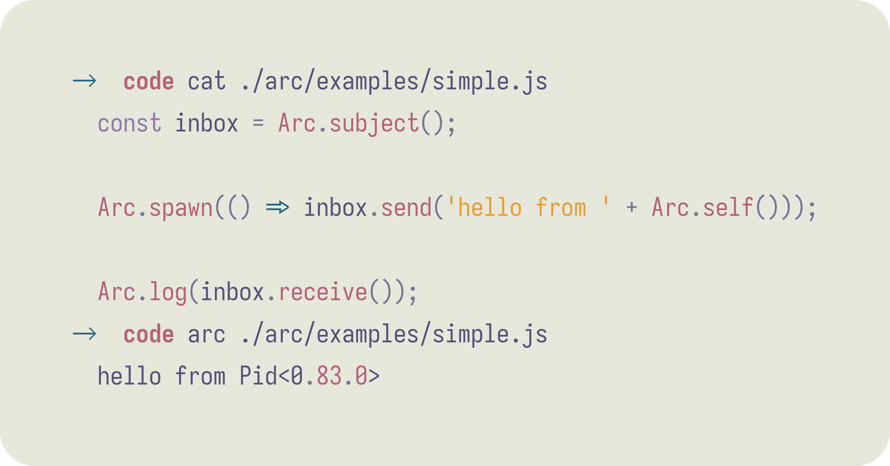
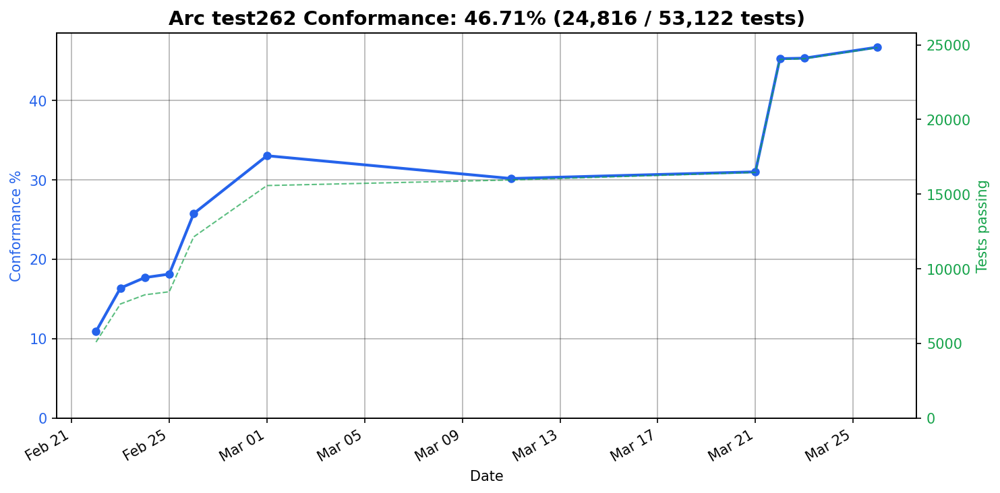

> [!NOTE]
> arc is an **extremely early** research project, tread carefully!

# arc ⌒

JavaScript on the BEAM.

<picture>
  <source media="(prefers-color-scheme: dark)" srcset="./.github/js.png">
  
</picture>
<br><br>

Traditionally, JavaScript does concurrency with one event loop and a shared heap. The BEAM does it with isolated processes that share nothing. Arc is an experiment in running the former on the latter.

Arc is an entire JavaScript engine written in [Gleam](https://gleam.run). Every `Arc.spawn` is a real Erlang process. You can have millions of them, each with its own heap - no stop-the-world garbage collection, and a crash in one leaves the others untouched. These are guarantees JavaScript has never had.

Tested against [test262](https://github.com/tc39/test262) on every commit:

<picture>
  <source media="(prefers-color-scheme: dark)" srcset=".github/test262/conformance-dark.png">
  
</picture>

---

```sh
gleam run -- file.js       # run a script
gleam test                 # unit tests
TEST262_EXEC=1 gleam test  # full test262 suite
TEST262=1 gleam test       # parser-only test262
```
